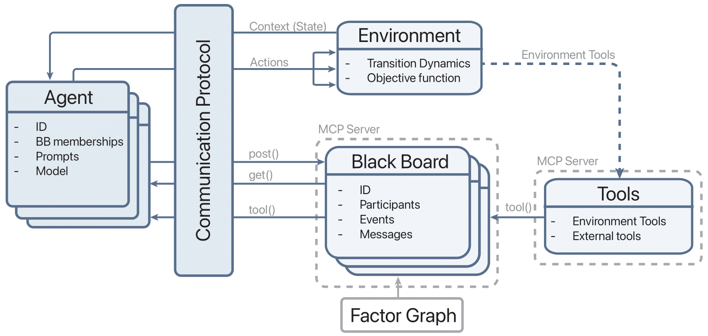

# Terrarium


## Overview :herb:

Terrarium is a hackable, modular, and configurable open-source framework for studying and evaluating decentralized LLM-based multi-agent systems (MAS). As the capabilities of agents progress (e.g., tool calling) and their state space expands (e.g., the internet), multi-agent systems will naturally arise in unique and unexpected scenarios. This repo aims to provide researchers, engineers, and students the ability to study this new agentic paradigm in an isolated playground for studying agent behavior, vulnerabilities, and safety. It enables full customization of the communication protocol, communication proxy, environment, tool usage, and agents. View the paper at [https://arxiv.org/pdf/2510.14312v1](https://arxiv.org/pdf/2510.14312v1).

This repo is under active development :gear:, so please raise an issue for new features, bugs, or suggestions. If you find this repo useful or interesting please :star: it!



## Features

- **Blackboards (Communication Proxies)**: Append-only event/communication log which acts as a component of the agent's observation and communication with other agents.
- **Two-Phase Communication Protocol**: The implemented communication protocol containes two phases, a (1) *planing phase* and an (2) *execution phase*. The planning phase enables communcation between agents to faciliate better action selection during the executation phase. During the executation phase, the agents take **actions** that affect their environment. This is done in a predefined sequential order to avoid environment simulation clashes.
- **Tooling Runtime + Optional External MCP**: Core environment and blackboard tools run in-process, and you can optionally attach external MCP servers per LLM client.
- **DCOP Environments**: DCOPs (Distributed Constraint Optimization Problems) have a **ground-truth solution** and a well-grounded evalution function, evaluating the actions taken by a set of agents. We implement DCOP environments from the [CoLLAB](https://openreview.net/pdf?id=372FjQy1cF) benchmark.
  - SmartGrid - A home agent's objecitve is to schedule appliance usage throughout the day without overworking the powergrid (Uses real-world home-meter data)
  - MeetingScheduling - A calendar agent is tasked with assigning meetings with other agents, trying to satisfy preferences and constraints with respect to other agents schedules (Uses real-world locations)
  - PersonalAssistant - An assistant agent chooses outfits for a human while meeting social norm preferences, the preferences of the human, and constrained outfit selection (Uses fully synthetic data)

## Documentation 

Use the following [documentation](https://aisec.cs.umass.edu/projects/terrarium/docs) for detailed instructions about on how to use the framework. 

Follow the quick guide provided below for basic testing.

## Quick Start

### Install (PyPI)

Install Terrarium:
```bash
pip install "terrarium-agents[providers,science,plots]"
```

CoLLAB is required for the DCOP environments. Clone it somewhere and point Terrarium at it:
```bash
git clone https://github.com/Saad-Mahmud/CoLLAB_SEA.git /path/to/CoLLAB
export TERRARIUM_COLLAB_PATH=/path/to/CoLLAB
```

Optional extras:
- `terrarium-agents[openai]`, `terrarium-agents[anthropic]`, `terrarium-agents[gemini]` (provider SDKs)
- `terrarium-agents[vllm]` (local vLLM serving; heavy)
- `terrarium-agents[all]` (everything)

Public environment import path:
```python
from terrarium.environments import JiraTicketEnvironment
from terrarium.environments.dcops import HospitalEnvironment
```

Public LLM import path:
```python
from terrarium.llm.clients import OpenAIClient
from terrarium.llm.vllm import VLLMProviderRuntime
```

### Install (Source)

Clone the repository and update submodules. A submodule exists at `external/CoLLAB` for a suite of external environments.
```bash
git clone <repository-url> Terrarium
cd Terrarium
git submodule update --init --recursive
```

In this repo, we use [uv](https://docs.astral.sh/uv/) as our extremely fast package manager. If not already installed follow these [installation instructions](https://docs.astral.sh/uv/getting-started/installation/).
```bash
# Run this at the root directory .../Terrarium
uv venv --python 3.11 .venv
source .venv/bin/activate
uv sync
```
---
Terrarium enables two types of servicing: (1) API-based providers and (2) [vLLM](https://github.com/vllm-project/vllm) integration for open-source models.

For API-based providers, we currently support OpenAI, Google, Anthropic, and [together.ai](https://api.together.ai/) models. Copy `.env.example` to `.env` and set your API keys (never put real keys in `.env.example`).
```bash
cp -n .env.example .env
# Edit `.env` and set (as needed):
# OPENAI_API_KEY=...
# GOOGLE_API_KEY=...
# ANTHROPIC_API_KEY=...
# TOGETHER_API_KEY=...
# FIREWORKS_API_KEY=...
```
Next, set the model and provider you want to use at `llm.provider` and `llm.<provider>.model` in `examples/configs/<config>.yaml`.

For vLLM servicing, simply set `llm.provider:"vllm"` and `llm.vllm.auto_start_server:true` in `examples/configs/<config>.yaml` for auto-startup and shutdown for a single run. If you require a persistent vLLM server, which is useful for using the same vLLM model for different configurations or environments without the costly startup time, then set `llm.vllm.persistent_server:true`. To kill all vLLM servers run `pkill -f vllm.entrypoints.openai.api_server`.

### Running a Multi-Agent Trajectory
1. Run a simulation using an execution script along with a config file:
```bash
python examples/base_main.py --config <yaml_config_path>
```

## Attack Scenarios

Terrarium ships three reference attacks that exercise different points in the stack. Implementations live in `attack_module/attack_modules.py` and can be mixed into any simulation via the provided runners.

| Attack | What it targets | Entry point | Payload config |
| --- | --- | --- | --- |
| Agent poisoning | Replaces every `post_message` payload from the compromised agent before it reaches the blackboard. | `examples/attack_main.py --attack_type agent_poisoning` | `examples/configs/attack_config.yaml` (`poisoning_string`) |
| Context overflow | Appends a large filler block to agent messages to force downstream context truncation. | `examples/attack_main.py --attack_type context_overflow` | `examples/configs/attack_config.yaml` (`header`, `filler_token`, `repeat`, `max_chars`) |
| Communication protocol poisoning | Injects malicious system messages into every blackboard via the communication layer. | `examples/attack_main.py --communication_protocol_poisoning` | `examples/configs/attack_config.yaml` (`poisoning_string`) |

### Running agent-side attacks

Use the unified driver to launch both the standard run and the selected attack:

```bash
# Agent poisoning example
python examples/attack_main.py \
  --config examples/configs/meeting_scheduling.yaml \
  --poison_payload examples/configs/attack_config.yaml \
  --attack_type agent_poisoning

# Context overflow example
python examples/attack_main.py \
  --config examples/configs/meeting_scheduling.yaml \
  --poison_payload examples/configs/attack_config.yaml \
  --attack_type context_overflow
```

## Quick Tips
- When working with Terrarium, use sublass definitions (e.g., A2ACommunicationProtocol, EvilAgent) of the base module classes (e.g., CommunicationProtocol, Agent) rather than directly changing the base module classes.
- When creating new environments, ensure they inherit the AbstractEnvironment class and all methods are properly defined.
- Keep in mind some models (e.g., gpt-4.1-nano) are not capable enough of utilizing tools to take actions in the environment, so track the completion rate such as `Meeting completion: 15/15 (100.0%)` for MeetingScheduling.

## vLLM Provider (Open-Source Models)
1. Install vLLM (`pip install vllm`) and make sure CUDA is available.
2. Set `llm.provider: "vllm"` in your config and describe the single server under `llm.vllm`.
3. All agents share the one configured vLLM model; advanced routing is disabled in this setup.

Best *small* model for successful tool use tested so far: Qwen/Qwen2.5-7B-Instruct. We have not tested on large >70B open-source models, but use use the [Berkeley Function-Calling Leaderboard - BFCL](https://gorilla.cs.berkeley.edu/leaderboard.html) as a reference.

Minimal example:

```yaml
llm:
  provider: "vllm"
  vllm:
    auto_start_server: true
    persistent_server: false
    startup_timeout: 180
    models:
      - checkpoint: "/data/models/Qwen2-7B-Instruct"
        served_model_name: "Qwen2-7B-Instruct"
        host: "127.0.0.1"
        port: 8001
        tensor_parallel_size: 1
        trust_remote_code: true
        additional_args:
          - "--max-model-len"
          - "65536"
```

If `auto_start_server` is true and the configured endpoint is unreachable, Terrarium launches `python -m vllm.entrypoints.openai.api_server` with the supplied checkpoint and writes stdout/stderr to `logs/vllm/<model_id>.log`. Processes are cleaned up automatically after each run.

## Dashboard

Consolidates runs and logs into a static dashboard for easier navigation:

1. Export the data bundle (runs + config):

   ```bash
   python dashboards/build_data.py \
     --logs-root logs \
     --config examples/configs/meeting_scheduling.yaml \
     --output dashboards/public/dashboard_data.json
   ```

2. Serve the static front-end (or simply open the file via your browser if it allows `file://` fetches – a local server is recommended):

   ```bash
   python -m http.server 5050 --directory dashboards/public
   ```

3. Navigate to <http://127.0.0.1:5050> to inspect the raw event logs parsed directly from `dashboard_data.json` in the browser (no backend required).

4. New runs? Simply repeat step (1.) and refresh the website (No need to restart the server)

## Tooling (In-Process + External MCP)

Environment and blackboard tools are executed in-process by Terrarium (no Terrarium MCP server process required).
Examples: MeetingScheduling -> `attend_meeting`, PersonalAssistant -> `choose_outfit`, SmartGrid -> `assign_source`.

You can optionally attach external MCP servers at `llm.external_mcp_servers`:

```yaml
llm:
  provider: "openai"
  external_mcp_servers:
    - name: "filesystem"
      url: "http://127.0.0.1:9000/mcp"
      enabled: true
      tool_prefix: "fs_"
      # include_tools: ["read_file", "write_file"]
      # exclude_tools: ["dangerous_tool"]
      # timeout_seconds: 20
```

External tools are auto-discovered and exposed to each client as regular function-calling tools.


## Logging

Terrarium incorporates a set of loggers for prompts, tool usage, agent trajectories, and blackboards. All loggers are defined in `terrarium/core/logger.py`, conisting of
- BlackboardLogger -- Logs events for all existing blackboards in human-readable format (Useful for tracking conversations between agents and tool calls)
- ToolCallLogger -- Tracks the tool called, success, and duration for each agent (Useful for debugging tool implementations)
- PromptLogger -- Shows exact system and user prompts used (Useful for debugging F-string formatted prompts)
- AgentTrajectoryLogger -- Logs the multi-step conversation of each agent showing their pseudo-reasoning traces (Useful for approximately evaluating the internal reasoning of agents and their associated tool calls)

All logs are saved to `logs/<environment>/<tag_model>/<run_timestamp>/seed_<seed>/`, including a snapshot of the config used for that run.

## :page_facing_up: Paper Citation
If you use this repository in your research, please cite:
```bibtex
@article{nakamura2025terrarium,
  title={Terrarium: Revisiting the Blackboard for Multi-Agent Safety, Privacy, and Security Studies},
  author={Nakamura, Mason and Kumar, Abhinav and Mahmud, Saaduddin and Abdelnabi, Sahar and Zilberstein, Shlomo and Bagdasarian, Eugene},
  journal={arXiv preprint arXiv:2510.14312},
  year={2025}
}
```

## :raised_hands: Contributing

We love contributions of all sizes, from typo fixes to new features :sparkles:

### Ways to contribute :seedling:
- :bug: Report bugs or unexpected behavior
- :bulb: Propose new features or environment ideas
- :memo: Improve docs, examples, and tutorials
- :toolbox: Add tools, attacks, or evaluation workflows

### Contribution workflow :rocket:
1. Fork the repository and clone your fork.
2. Create a branch:
   ```bash
   git checkout -b feature/short-description
   ```
3. Make your changes and update tests/docs where relevant.
4. Run local checks relevant to your change.
5. Commit with a clear message:
   ```bash
   git commit -m "feat: short summary"
   ```
6. Push your branch and open a Pull Request:
   ```bash
   git push origin feature/short-description
   ```

### PR checklist :white_check_mark:
- [ ] :dart: Change is focused and scoped
- [ ] :book: Docs/examples updated if behavior changed
- [ ] :test_tube: Relevant tests pass (or rationale included if not applicable)
- [ ] :speech_balloon: PR description explains what changed and why

For larger changes, open an issue or discussion first so we can align on scope and avoid overlap. **New contributors** are absolutely welcome here, so if you are unsure where to start, open an issue and we can help point you in the right direction :blush:


## License

MIT. See `LICENSE`.
